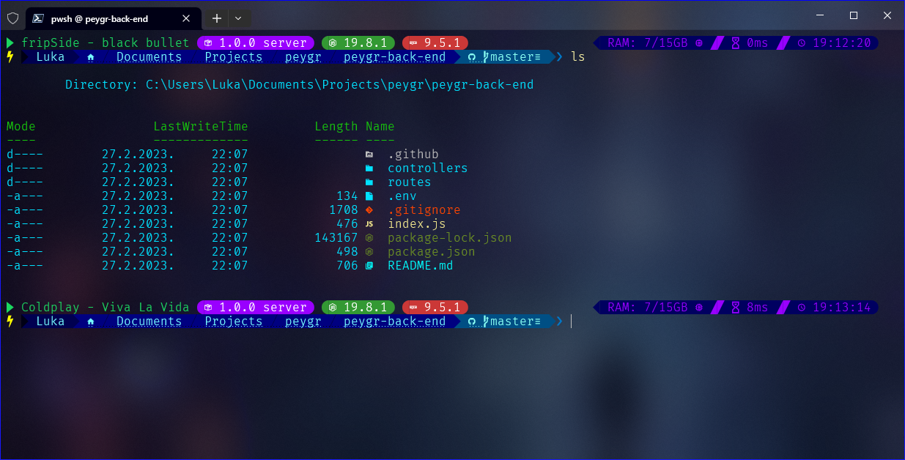

# powershell
My powershell configuration and customisation

- If a song is currently playing on Spotify, the name of the song will be displayed. If nothing is currently playing, no information will be shown.
- The project version, programming language version, and package manager information are all displayed.
- Additional information includes the amount of RAM used, the time it took to execute the last command, and the current time.
- The current directory is displayed along with a clickable link to open it in Explorer. If the directory contains a .git file, the git status is also displayed.
